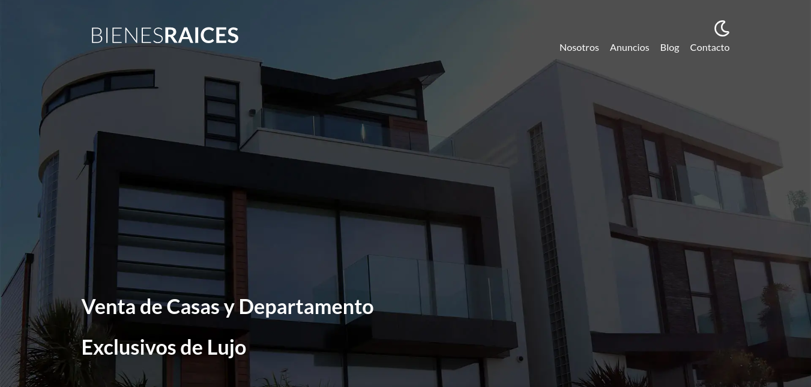
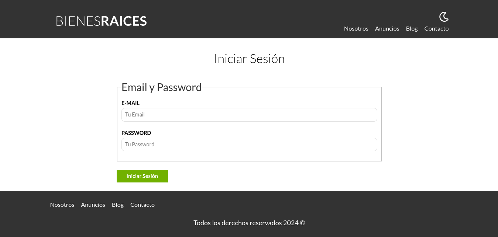
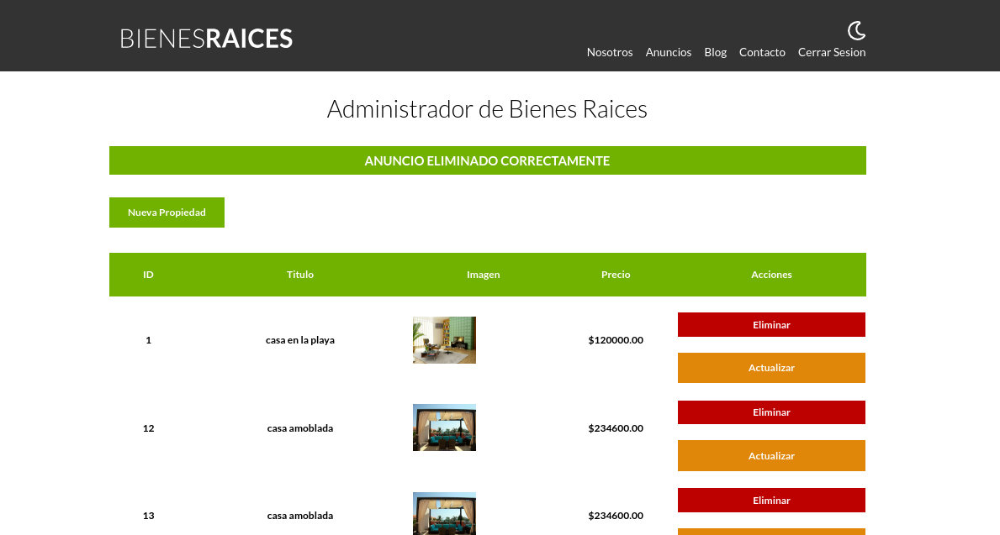
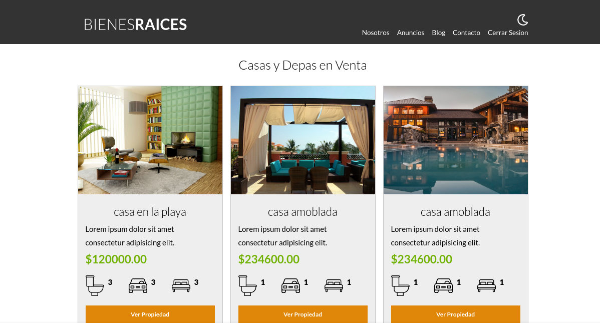

# Bienes Raices
En este proyecto el cliente podrá mostrar sus bienes raíces con los precios correspondientes para poder venderlos.

## Descripción
- Tiene un panel administrativo donde se podrá crear, listar, modificar y eliminar (CRUD) las propiedades.
- También incluye un sistema de logueo para poder acceder a este panel administrativo solo con el correo y la contraseña correcta. 
- Posee conexión a una base de datos MySQL.
- Se hizo la minificación en el código de JavaScript y del CSS para aligerar el peso del archivo.
- Se aligeró el tamaño de las imágenes con Gulp.

## Tecnologías utilizadas
- PHP
- MySQL
- JavaScript
- Sass
- Gulp
- HTML
- CSS

**Página de Inicio**

**Página de Login**

**Panel Administrativo**

**Lista de Propiedades**
